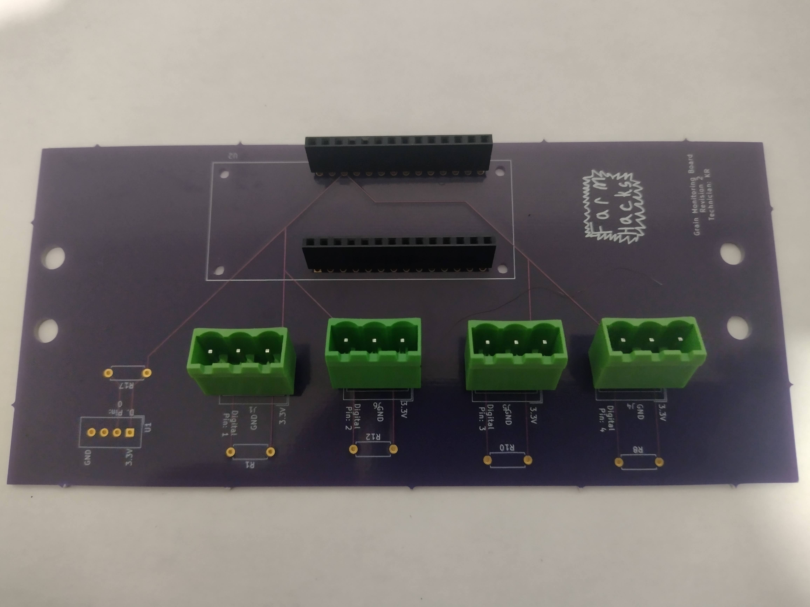

# 1. Introduction
This document will hopefully give enough instructions so that anyone who reads it could assemble the PCB in question as long as they have enough experience soldering.

# 2. Needed skills, materials/tools, and parts
## 2.1 Skills
The only non-common/specialized skill needed to complete this assembly is hand soldering of electronics. A good tutorial on instructables can be found here: https://www.instructables.com/How-to-Assemble-a-Printed-Circuit-Board-PCB/.

As said in the tutorial I would recommend practicing with some resistors and a solderable breadboard if you have never soldered before. A solderable breadboard available on digikey can be found here: https://www.digikey.ca/en/products/detail/sparkfun-electronics/PRT-08808/7387401.

## 2.2 Material/tools
You will need a standard fine tip **soldering iron** to do the soldering. I personally use a single temperature not so fine tipped soldering iron, but I should probably upgrade. Along with the soldering iron you will need **solder** I use 23 gauge solder, but a lower gauge would probably work.

You will also need a pair of **side cutters** to cut away the stray wires after assembling the board.

## 2.3 Parts
If you are reading this document in a kit that you bought then all of the following parts should be included. If you did not buy a kit then you can order all of the parts from digikey with the links beside the items, but the PCB you would have to use the files in the ecad folder to order your own custom PCB.

1. 2 14 pos Stackable headers (https://www.digikey.ca/en/products/detail/sullins-connector-solutions/PPTC141LFBN-RC/810152)

2. 4 pluggable PCB mountable connectors (https://www.digikey.ca/en/products/detail/te-connectivity-amp-connectors/2351885-3/10415935)

3. 4 560 Ohm to 4.7 K Ohm resistors (https://www.digikey.ca/en/products/detail/yageo/cfr-25jb-52-560r/2464)
  - difference in resistance values will be discussed (below are 560 Ohm resistors)

4. 1 10K Ohm resistor (https://www.digikey.ca/en/products/detail/stackpole-electronics-inc/CF14JT10K0/1830374)
5. 1 DHT 22 sensor (https://www.digikey.ca/en/products/detail/adafruit-industries-llc/385/5774230)
  - below photo contains both the dht22 sensor and the 10K Ohm resistor

6. Custom PCB being explained in this tutorial (see the ecad folder)

# 3. Assembly
## 3.1 14 pos Stackable Headers
The first thing I would solder on would be the stackable headers, which are shown below on the PCB. To solder them you will have to flip the board upside down from what was shown in the photo, and with the current design you'd have to prop it up with something so it does not tip.

## 3.2 Pluggable PCB Mountable Connectors
Next can be either the PCB Mountable connectors or the resistors. Shown below are the PCB mountable connectors being put on before the resistors. This could make it hard to solder both the top and bottom of the resistors, but I usually only sodlder the bottom.

Note the orientation of the connectors since that is the orientation I will assume in later documents that people used.

## 3.3 All Resistors
The resistors shown here are all 560 Ohm resistors, but resistors up to 4.7 K Ohm can be used depending on how far away your particular bins are. The further away they are the lower the resistance value you have to use, and this is because of how the DS18B20 sensors communicate. If in doubt use the lower resistance value in this case. More can be read here: https://learn.sparkfun.com/tutorials/pull-up-resistors/all, and another place is here https://www.electronics-tutorials.ws/logic/pull-up-resistor.html.

Below shows all the resistors being added to the PCB. The orientation of the resistors do not matter here.

## 3.4 DHT 22 Sensor
The last put to add is the DHT 22 sensor. The orientation of this one is critical since it will not work the other way. If you look at the PCB the pin values of the DHT are also labeled, so use them as a guide as well.

Extra info about the DHT22 sensor: https://learn.adafruit.com/dht

## 3.5 Cut Away Stray wires
The last step is to cut away the stray wires that are at the bottom of the board. I would cut the stray wires from the resistors, and trim the wires coming from the DHT 22.

# 4. Conclusion
Well I hope this document was enough to guide you in assembling the grain sensor PCB board. If not you can make an issue in the github, or if you bought a kit from me you can reach out directly.
