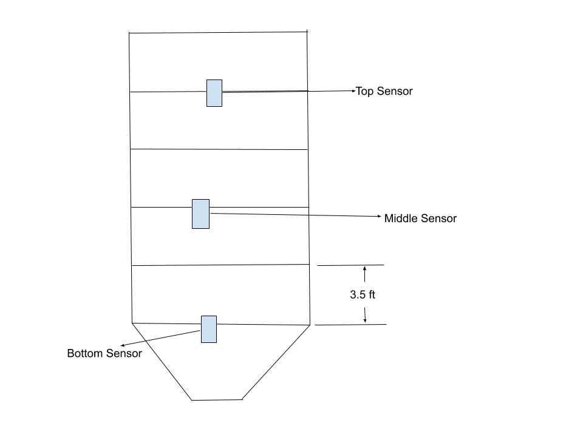
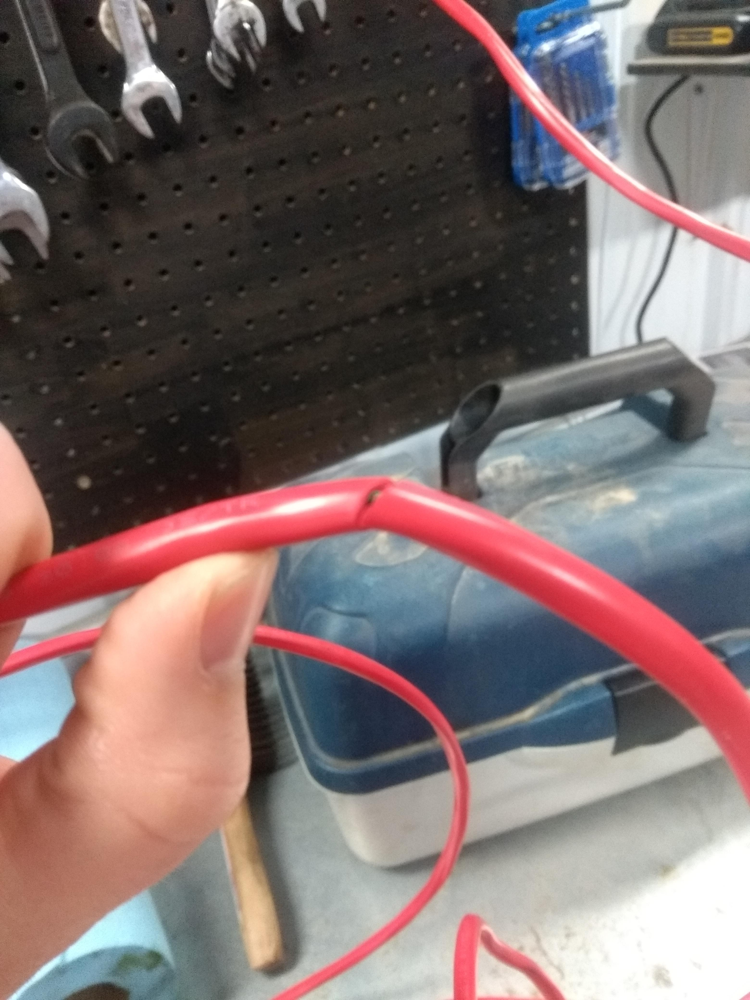
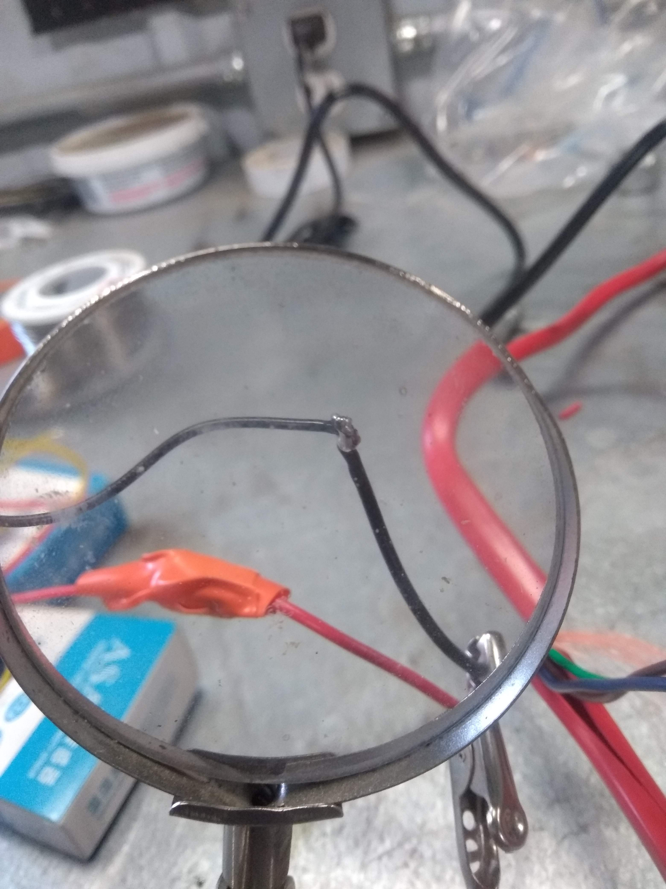
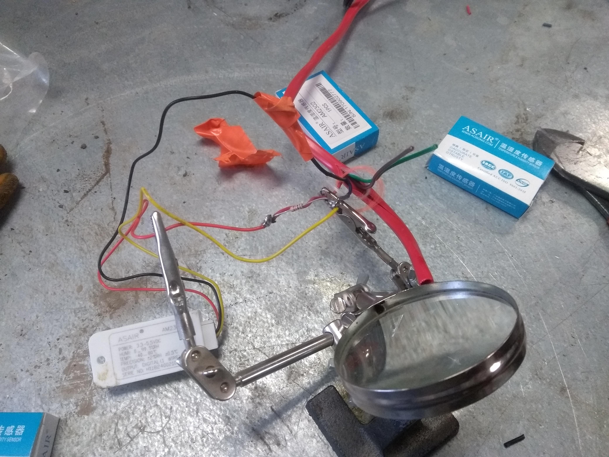
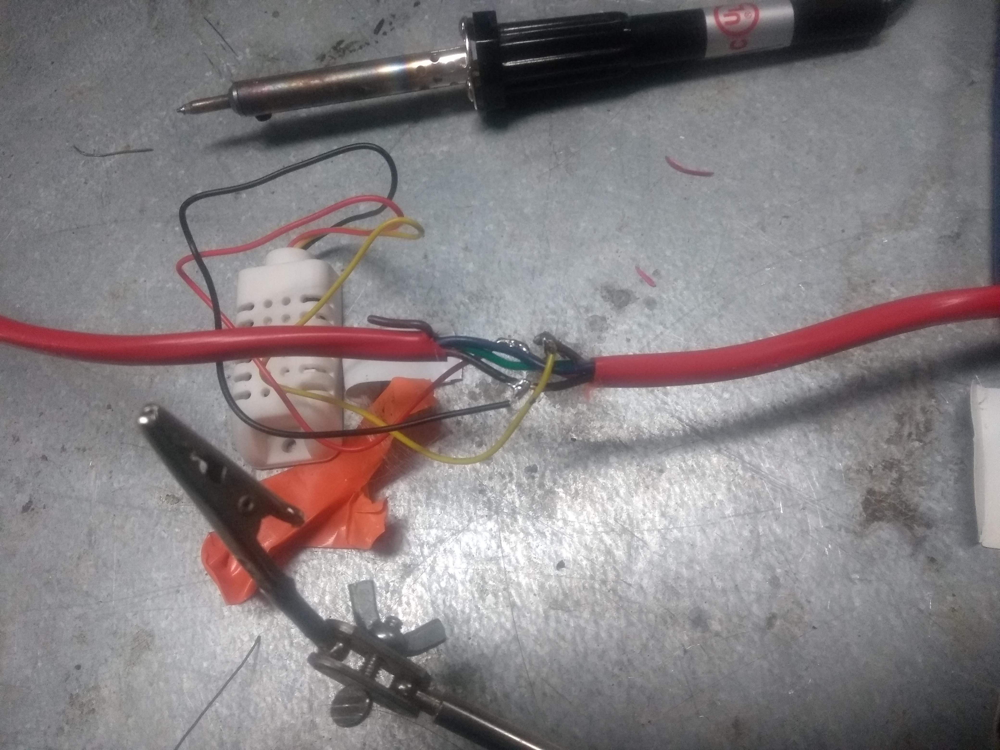
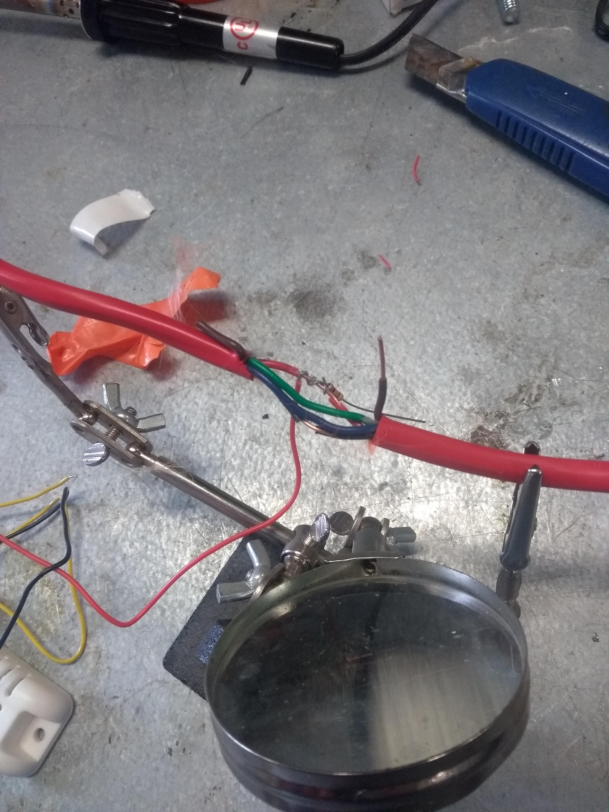
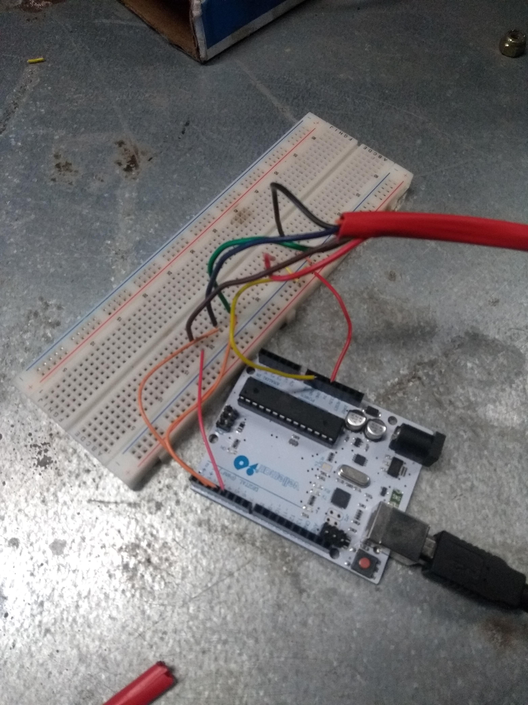

# Goals and Description
1. Outline the steps to make a temperature cable
2. Spread the cheer of grain monitoring far and wide

# Materials needed
- 3 DHT 22 sensors
- 3 10k $\Omega$
- Some wire (I used 60 ft for a 25ft tall bin)
- Solder & soldering iron

## Step One: Measure The Bin
The easiest way to do this is to measure the height of one ring and then count how many rings there are. In my case I measured one ring to be roughly 3.5 feet, and I counted 5 rings in total. That makes a total height of $3.5ft \times 5 = 17.5ft$.

To gauge how long the entire cable needs to be I estimated the height of the top to be 5ft to 8.5ft. That brings the total height estimate to 25ft so doubling that brings me to 50ft and then an extra 10ft gives some leeway to hook up the arduino later.

## Step Two: Decide where to place the sensors
Placing the sensors have to be done with some care. The top sensor should be in the top ring or lower so it is covered by the grain, and the bottom sensor needs to be somewhere around the start of the hopper but can not be at the bottom.

What I did was to place the bottom sensor first and then the space the other two 7ft away from each other. This should give good overall coverage of the bin, and also ensure that each sensor is in the grain. 

Below is an outline of how my sensors should line up in the bin.

## Step Three: Mark where the sensors go on the main cable
Before I started attaching the sensors I used a knife to mark the places where the sensors are to go. A photo can be seen below.

## Step Four: Attach the sensors to the main cable
### Bottom Sensor
1. Strip the power (I used the red one) and the ground (I used the black one) just a enough so the sensor can be attached. 
****
**** Need photo here
****

2. Now strip one of the other three wires to be used for the data pin. (Note which one you use so that you know which wire is the bottom sensor)
3. Solder the black wire of the sensor to the ground.

4. Solder the red wire and the resistor to the power wire. 
******
****** Add the photo
******

5. Solder the yellow wire (data wire) to the wire you selected for the bottom's data. Also solder the other end of the resistor to the wire selected for the data.

6. Tape the red wire and the data wire together first (best you can, just to make sure the ground doesn't touch any of them)
7. Tape all the wires together up to the sensor
******
****** Add the photo
******

### Top and Middle Sensor
1. Cut away some the insulation around all five wires so that the individual wires are exposed.
2. Cut away some of the insulation on the power and ground so that the bare wire is exposed. 
3. Snip the data next data wire (each data wire must be different)
4. Now follow the bottom sensor instructions starting at step 3. It will look slightly different so I have included so additional photos.

## Step Five: Test the cable
1. Program the Arduino MKRGSM with the file test/one_bin_test.ino
2. Attach the ground to the ground and the power to the 5V.
3. Attach the bottom cable data pin to pin 1, attach the middle cable data pin to pin 2, and the top to pin 3.
4. Power the Arduino and let it run for awhile. You should be recieveing the temperature and whether the temperature has increased on one of the sensors each 15 minutes.\

## Step Six: Attach rope to cable with Gorilla Tape
If everything went well with the test it is time to finish the cable. I attached a hefty rope to the wire with gorilla tape so that there is slightly more structure. Veiw the photo below.
******
****** Add the photo
******

# Conclusion