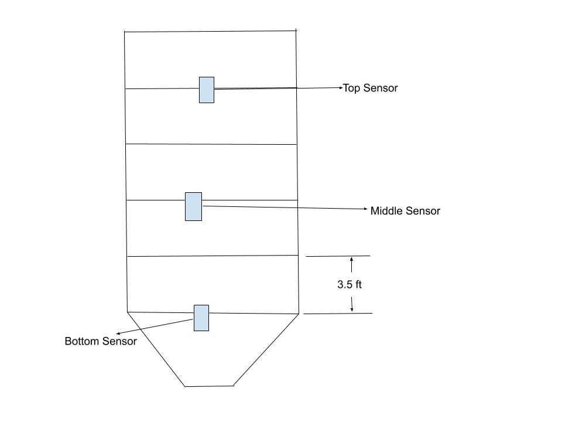
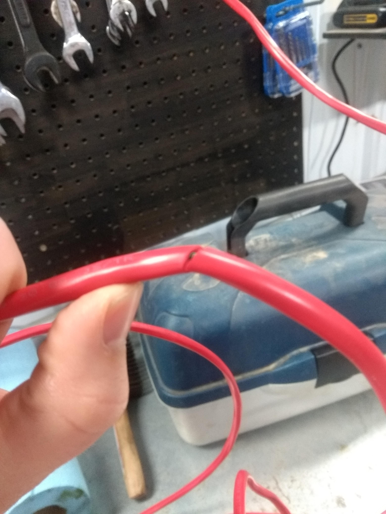
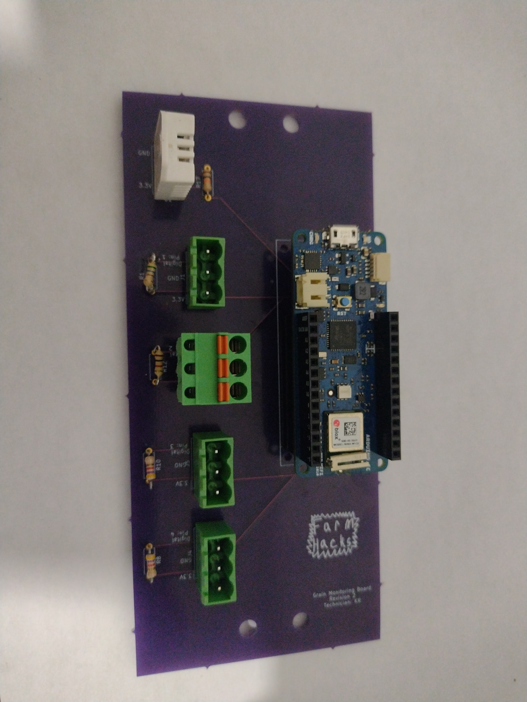

# 1. Introduction
This how-to will hopefully explain to you how to create your own temperature cable to place within a bin using DS18B20 sensors. After completing the construction of the cables you can move on to put together the rest of the grain monitoring system outlined.

# 2. Needed skills, materials/tools, and parts
## 2.1 Skills
The only non-common/specialized skills needed to complete this how-to is hand soldering of wires and programming of Arduinos. A great tutorial on youtube can be seen here: https://www.youtube.com/watch?v=Zu3TYBs65FM. If you follow that guy you will solder better than I do.

For programming an Arduino I would recommend reading this article: If you have not done this before I would recommend reading the following article: https://www.digikey.ca/en/maker/blogs/2018/how-to-get-started-with-arduino.

## 2.2 Material/tools
You will need a standard fine tip **soldering iron** to do the soldering. I personally use a single temperature not so fine tipped soldering iron, but I should probably upgrade. Along with the soldering iron you will need **solder** I use 23 gauge solder, but a lower gauge would probably work.

You will also need a pair of **side cutters** to cut away the stray wires after assembling the board.

The last tool you will need is a pair of wire **strippers**.

## 2.3 Parts
- 4 DS18B20 sensors (https://www.digikey.ca/en/products/detail/adafruit-industries-llc/381/5875807)
- Some wire (https://www.homedepot.ca/product/southwire-18-3-fas-lvt-thermostat-wire-150m-brown/1000794341)
  - I used 60 ft of fire alarm cable for a 25ft tall bin

# 3. Assembly
## 3.1 Measure The Bin
The easiest way to do this is to measure the height of one ring and then count how many rings there are. In my case I measured one ring to be roughly 3.5 feet, and I counted 5 rings in total. That makes a total height of $3.5ft \times 5 = 17.5ft$.

To gauge how long the entire cable needs to be I estimated the height of the top to be 5ft to 8.5ft. That brings the total height estimate to 25ft so doubling that brings me to 50ft and then an extra 10ft gives some leeway to hook up the arduino later.

## 3.2 Decide where to place the sensors
Placing the sensors have to be done with some care. The top sensor should be in the top ring or lower so it is covered by the grain, and the bottom sensor needs to be somewhere around the start of the hopper but can not be at the bottom.

What I did initially was to place the bottom sensor first and then the space the other two 7ft away from each other. During operation it was realized that this did not give adequate coverage of the bin and it was decided to increase the amount of sensors to 4 and to place them 4ft apart.

Below is an outline of how my sensors should line up in the bin.



## 3.3 Mark where the sensors go on the main cable
Before I started attaching the sensors I used a knife to mark the places where the sensors are to go. A photo can be seen below.



When doing longer cables I would attach a sensor and then mark the next one just because it was getting to become cumbersome to deal with all the wire that was strewn around the shop.

## 3.4 Attach the sensors to the main cable
Before placing all the sensors on the cable it is advisable to slide three pieces of heat shrink (about 6 inches in length) onto the cable to be used later to cover up all the connections made while attaching the sensors.

### 3.4.1 Bottom Sensor
1. Strip the power (I used the red one) and the ground (I used the black one) just a enough so the sensor can be attached. To see the what the different colours of the DS18B20 sensors are I would go to the datasheet from that particular manufacturer. In the case of version linked above a table is provided below:

| Colour | Purpose |
| ------ | ------- |
| Blue   | Ground  |
| Yellow | Data    |
| Red    | Power   |

The only other colour I have seen is black for ground instead of blue.

2. Now strip the wire that will be used as the data pin.

3. Solder the black wire of the sensor to the ground.

4. Solder the red wire to the power.

5. Solder the last wire (yellow wire on my devices) to the conductor that will be used as the data wire.

6. Put some electrical tape around each of the solders.
  - Note: for this one heat shrink could be used, but for the following it could not

7. Apply the first heat shrink around the electrical connections. Do not heat the heat shrink until after the cable is tested in case something is wrong.


A photo of a DS18B20 sensor attached to the cable will be added later.

### 3.4.2 Middle and Top Sensor
1. Measure the decided amount of feet separating each sensor and mark the location.

2. Follow the steps done for the bottom sensor keeping in mind the sheathing will have to be cut away instead of stripped since it is in the middle of the cable.

Cable shown stripped in the middle.


The sensor soldered and attached in the middle.


The sensor tapped in the middle.


## 3.5 Test the Cable
### 3.5.1 Assemble the circuit
For this step you will need an assembled grain monitoring board, your freshly created cable, an MKR board, and a computer with the Arduino IDE installed. Plug the Arduino into the PCB and plug the cable into the female pluggable connector location with one of the male connectors (attach the male connector first). Below a photo shows the Arduino plugged in along with the male connector plugged into the female connector.



People more experienced with electronics can likely figure out other ways to assemble this circuit but I will not get into them here.

### 3.5.2 Edit Code
The code to be using can be found at code/testing_code. What needs to be added/changed is the device addresses on lines 24, 25, 26 and 27. Those lines are shown below:
```
DeviceAddress top = { 0x28, 0x63, 0x38, 0xF3, 0x4C, 0x20, 0x01, 0xD2 };
DeviceAddress middle_top = {  };
DeviceAddress middle_bottom = {  };
DeviceAddress bottom = {  };
```
The address labeled top is filled out as an example but it will have to be replaced with the address on the label that was on the top DS18B20s bag. Each of the other addresses will also have to be labeled.

### 3.5.3 Upload Code
Once the code is edited you will have to upload it to the Arduino.

### 3.5.4 Check the sensors
First open the serial monitor while the Arduino is plugged in to view the temperature the Arduino is reading. When it is open I would go and warm the individual sensors as they are running to ensure the sensors were placed in the correct locations.

## 3.6 Complete the Cable
If the testing went as planned take a heat gun (or a torch if you do not have one), and heat the heat shrink to seal the connections.

# 4. Conclusion
This concludes the tutorial of how to create the DS18B20 based temperature monitoring cable. I hope that my explanations were enough but if they weren't please open an issue in the GitHub or if you bought a kit you can reach out to me directly.
