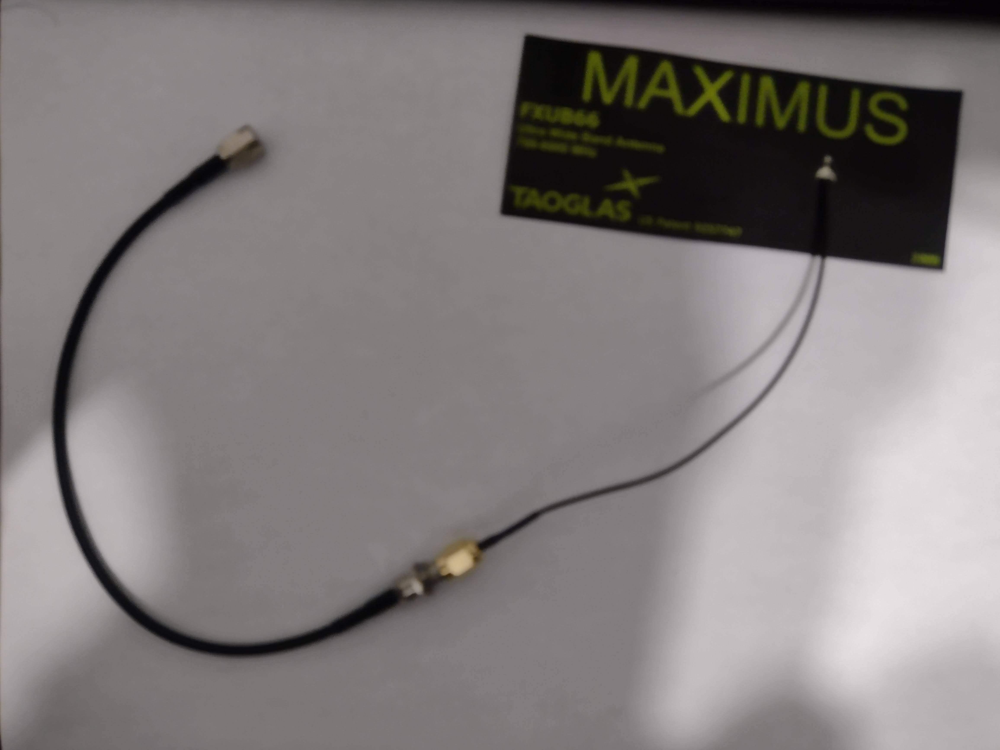
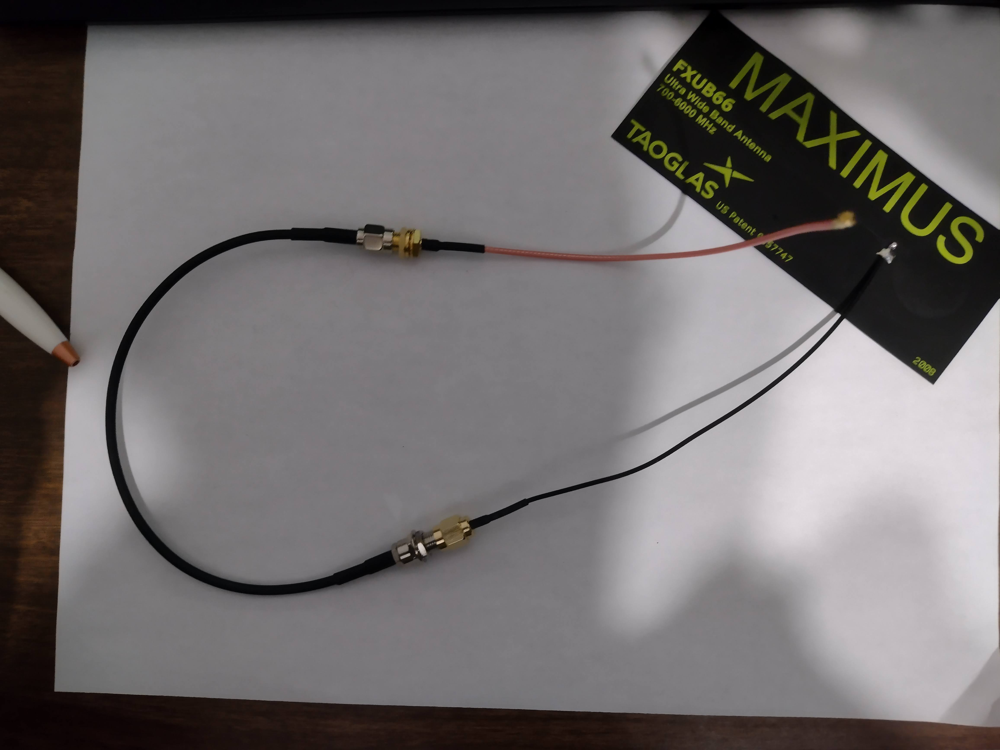
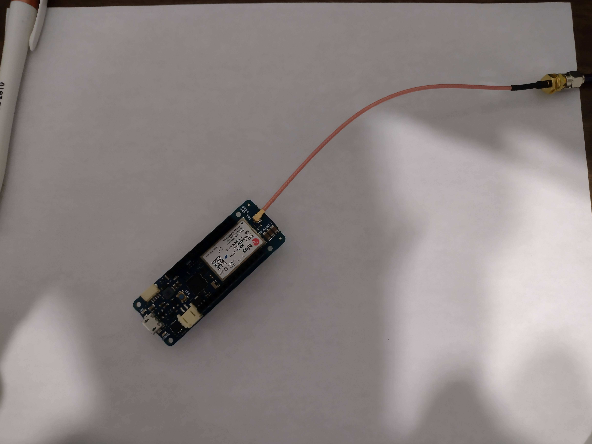

# 1. Introduction
This short how-to will list the parts needed to some larger antennas to the MKR 1400 board. You do not need to read this if you are going to use the basic antenna such as, this one made by Arduino, https://www.digikey.ca/en/products/detail/arduino/X000016/7793242, or this one made by Adafruit, https://www.adafruit.com/product/1991.

I should note my knowledge of antennas is limited and I have not had consistent success with these antennas, but I did have trouble initially figuring out what parts were needed so I thought I'd include this to document my limited knowledge.

# 2. Needed skills, materials/tools, and parts
## 2.1 Skills
No specialized skills are needed for this.

## 2.2 Material/tools
No tools or materials are needed except for the parts that will be part of the final assembly.

## 2.3 Parts
If you bought a kit from me than the antenna made by Arduino will be included but these parts will not be. I would consider using these parts if you need a higher gain antenna, or if you want to place your antenna a far distance away from the enclosure.

1. One of the following (or a similar one):
  - Magnetic Base Antenna: https://www.digikey.ca/en/products/detail/taoglas-limited/GA-107-201111/2332671
  - Large Flat Patch Antenna: https://www.digikey.ca/en/products/detail/taoglas-limited/FXUB66-01-0150C/3877413
  - Others: Make sure it is sensitive to GSM frequencies and that it has a SMA Male end
2. RP-SMA to SMA (Female to Female) : https://www.digikey.ca/en/products/detail/linx-technologies-inc/CSA-RPSM-216-SAFB/1962866
3. U.FL (UMCC) to RP-SMA : https://www.digikey.ca/en/products/detail/adafruit-industries-llc/852/6827042

# 3. Assembly
1. Attach large antenna to "RP-SMA to SMA (Female to Female)"

2. Attach "U.FL (UMCC) to RP-SMA" to "RP-SMA to SMA (Female to Female)"

3. Attach to cable assembly to the Arduino and you have a your antenna ready

Special note is that the antenna attaches to the very small button looking thing on the Arduino MKR 1400 and sometimes you have to push the connector on, but it should go. 

# 4. Conclusion
This one is lacking on details I know, but that is because my knowledge is fairly limited and assembly wise it is pretty easy.
