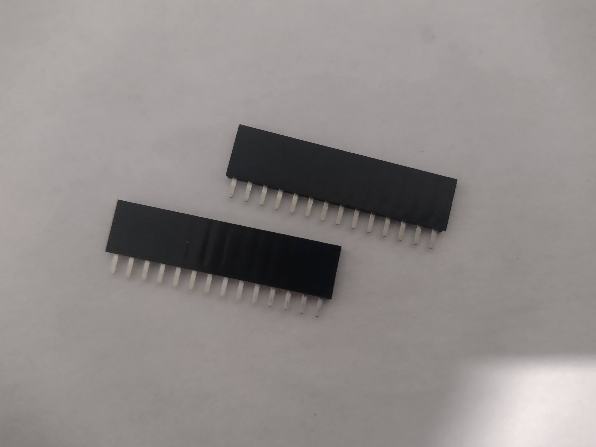
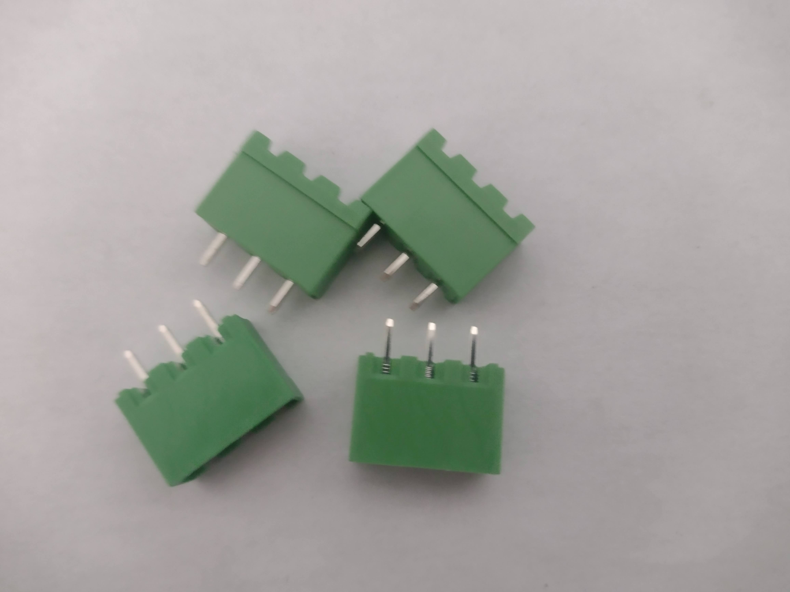

# 1. Introduction
The following document will explain how to assemble the project that I initially created the custom PCB that you may have bought if you are reading this message. The PCB could be used for any project that uses sensors that require a pull up resistor and 3.3V power, and that leaves a lot of open area.

Given that the potential projects are so wide open I decided to just describe a project I have used it for and will leave it to others to use it for that project or others.

## 1.1 Description of Project
I initially created this board to allow easy and simplified wiring for my grain monitoring cables. I pursued this grain monitoring project because my dad is a farmer and he wanted to monitor the temperature of his grain, but he did not want to pay the big price for the commercial versions of these products.

The project consists of 4 cables with 4 DS18B20 sensors attached to each cable and then those cables are attached to the board that is in the kit. The board contains a slot where an MKR board can be attached and where it is attached the sensors get connected to it. I know that those two sentences probably sound very condensed and they are so if you want to know more keep reading!

The rest of the document will discuss assembling this project.

# 2. Needed skills, materials/tools, and parts
## 2.1 Skills
Experience with Arduino Cloud and the Arduino IDE would be very helpful in completing the following instructions, but are not strictly nescessary. Experience soldering PCBs and wires together would also be helpful but is not nescessary.

Links to tutorials are provided in the sections in which the skills are needed.

## 2.2 Material/tools
Here I will list the materials and tools that are nescessary to assemble the kit, but that I do not supply.

- Soldering Iron
- Solder
- Side-cutters
- Wire strippers
- Micro-USB cable
- Fire Alarm Cable (about 60 ft per 5000 bushel bin plus distance of enclosure to bin)
- Enclosure (https://www.amazon.ca/gp/product/B075DJQJVY/ref=ppx_yo_dt_b_asin_title_o05_s00)
  - any enclosure that can hold the PCB and wires will do, the amazon one linked is just the one I used.

### MKR Boards
I have decided not to include the MKR boards at this time to give you the flexibility to choose which one is best. In the Antenna tutorial I explain what to order for antennas when using the MKR 1400.

These are the two boards I have used:

1. MKR 1010 : https://www.digikey.ca/en/products/detail/arduino/ABX00023/9486713
  - best success
2. MKR 1400 : https://www.digikey.ca/en/products/detail/arduino/ABX00018/8135631
  - inconsistent connection when I used

### DS18B20 Sensors
For this version of the kit that does not have the DS18B20 sensors 16 of those are required to complete the project.

## 2.3 Parts Included In Kit
These are all the parts that I will be supplying in the kits being sold on Tindie.

1. 2 14 pos Stackable headers (https://www.digikey.ca/en/products/detail/sullins-connector-solutions/PPTC141LFBN-RC/810152)

2. 4 pluggable PCB mountable connectors (https://www.digikey.ca/en/products/detail/te-connectivity-amp-connectors/2351885-3/10415935)

3. 4 560 Ohm to 4.7 K Ohm resistors (https://www.digikey.ca/en/products/detail/yageo/cfr-25jb-52-560r/2464)
  - difference in resistance values will be discussed (below are 560 Ohm resistors)

4. 1 10K Ohm resistor (https://www.digikey.ca/en/products/detail/stackpole-electronics-inc/CF14JT10K0/1830374)
5. 1 DHT 22 sensor (https://www.digikey.ca/en/products/detail/adafruit-industries-llc/385/5774230)
  - below photo contains both the dht22 sensor and the 10K Ohm resistor

6. Custom PCB created for this project (see the ecad folder)

7. 4 Terminal Plugs (https://www.digikey.ca/en/products/detail/te-connectivity-amp-connectors/2350397-3/10415914)

# 3. Location of the rest of the documents
I will be putting each separate document in the same location in the duotang (if you bought a kit), and I will outline that order here.

1. The overall outline (this document)
2. Address Logging
3. The PCB Assembly Document
4. The Temperature Cable Assembly Document
5. The Code Upload Document
6. Antenna Assembly Document

# 4. Suggested Assembly Order
## 4.1 PCB Assembly
The first thing I would do is assemble the PCB.

## 4.2 Temperature Cables
The second thing I would do would be to assemble the Temperature cables. This would include logging the one wire addresses of all the DS18B20 sensors that you have purchased.

## 4.3 Code Upload
The next step I would do would be to upload the code to the Arduino you choose to use.

## 4.4 Test Set Up
Now that everything is assembled I would plug each of the cables into the PCB and I would also plug in the Arduino to the board. The Arduino should be plugged in such that the micro-usb port is facing the end where the DHT 22 is located.

Hopefully, you marked the bin number for each cable and if so then you can plug in the cable into the corresponding plug on the board. The plugs should have a marking on the PCB that says 'Digital Pin: 1' and that number corresponds to the bin number.

Below is a photo of how the cable should look plugged in:

Note the wire colours and their locations. My blue wire was the data wire, black was ground, and red was 3.3V or power on the ds18b20.

Blue -> Digital Pin
Black -> GND
Red -> 3.3V

The PCB should have notes showing this.

The Arduino needs to be powered with a standard cell phone charger (5V).

When everything is plugged in you can check whether it is working by looking at your 'things' page and checking if the arduino is transmitting temperatures.

## 4.5 Install Cables in the Bin
I simply climbed to the top of the bin while empty and dropped the cable in while my dad stayed on the ground and looked inside the bin to tell me how close I was to the bottom. Once we had the sensors in what we thought were good locations I fastened the cable to the bin with zip ties. The cable has to be long enough to be fastened to the outside of the bin and then to reach the Arduino, and for me that was 60ft if the Arduino was directly below the bin and more if the Arduino was farther away.

I would do some measurements if you won't be placing the Arduino directly under the bin to get the correct cable measurements.

## 4.6 Place PCB in Enclosure and plug everything in
If you are using the enclosure I used then you will either have to buy some strain reliefs and pop the rubber stoppers out, or you can just drill/cut a hole in the stopper like I did. Using a strain relief or similar connector would be more professional.

Try to pop out as few of the rubber stoppers as possible. I was able to get away with cutting a hole in three of them. Two to allow the cables in and one to allow the micro usb in.

First I would plug in the cables into their correct places, and then I would plug in the cell phone charger to the Arduino.

## 4.7 Monitor Away
Now all that is done you should be able to sit back and monitor the grain temperature of the grain in the bins you just installed a cable in. A good next step would be to create a Dashboard to collect all the data you are collecting, a good tutorial for that can be found here: https://create.arduino.cc/projecthub/amalbanyus/create-a-dashboard-with-the-arduino-iot-cloud-1a897b

# 5. Conclusion
Thank you for reading and for purchasing the kit (if that is how you got this document). If you have any questions feel free to open an issue on the github, https://github.com/PhysicsUofRAUI/binTempSensor, or if you bought the kit you can reach out to me directly via email.
