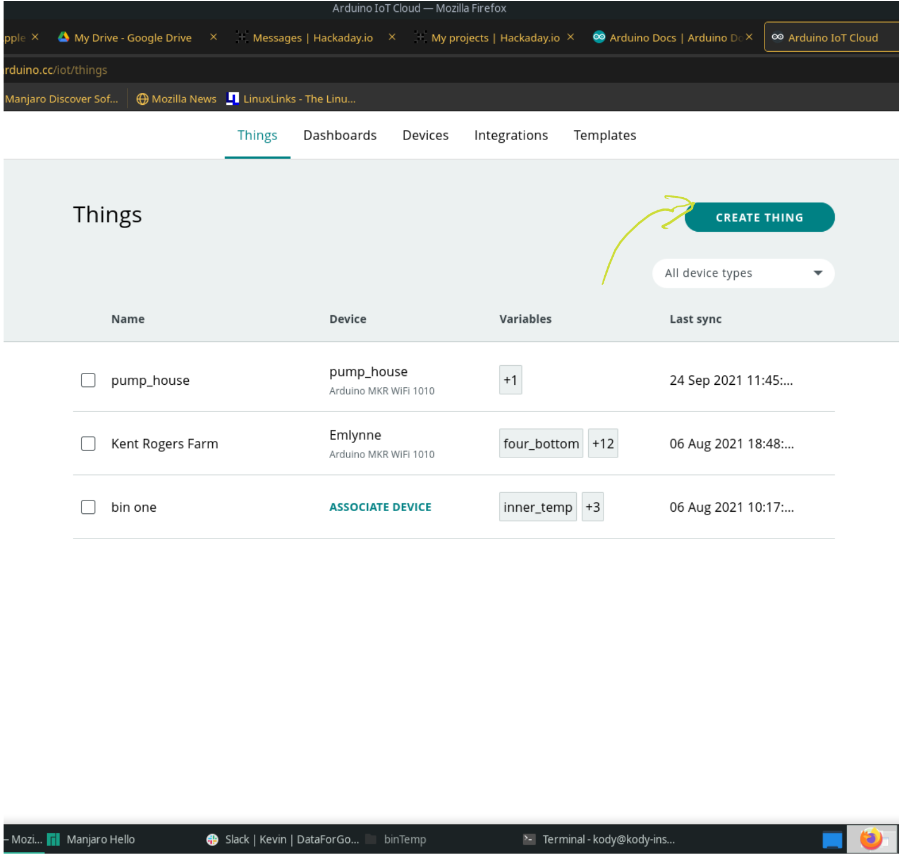

# 1. Introduction
This how-to will show you one of many potential options for upload the code that will monitor your grain's temperature. This tutorial is supposed to go with the ds18b20 sensor cables that were covered in a previous how-to.

# 2. Needed skills, materials/tools, and parts
## 2.1 Skills
The most specialized skill needed to complete this how-to is programming an Arduino for use with Arduino IoT Cloud. Now it so happens to be that the main point of this how-to is to aquaint the reader with Arduino IoT Cloud so that they can upload the code to their chosen MKR board and monitor their grain. All that considered it would be helpful to have some experience with Arduino IoT Cloud and a good place to get that is at this link: https://docs.arduino.cc/cloud/iot-cloud/tutorials/iot-cloud-getting-started.

## 2.2 Material/tools
A **micro-usb charging cable** is needed to plug into the computer to program the Arduino MKR Boards. It may be that the first one you try will not work and if that is the case you will have to try a new one. Below is a photo of what I am talking about.


## 2.3 Parts
If you are using the MKR 1010 (WiFi) then all you will need is the board itself. If you are using the MKR 1400 (GSM) then you will also need an antenna of some sort. There is an antenna cable assemble how-to for the larger antennas, but most cases the a small antenna like the this one made by Arduino, https://www.digikey.ca/en/products/detail/arduino/X000016/7793242, or this one made by Adafruit, https://www.adafruit.com/product/1991.

# 3. Uploading
I am going to show one way to upload the needed code to an Arduino MKR board. Note that this is not the way that I do it, but I think it may be easier for people how have not had as much experience with Arduino.

The way I would do it is edit the thingProperties.h file and the .ino file and then upload it with the Arduino desktop editor.

## 3.1 Getting the Base Code
I am going to outline two different ways to access the code. The first way is the easiest if you have git installed and have experience with git. If you do not have git installed then I advise going the other way and download the zip file from the GitHub website that contains all this code.

Downloading the repository will also give you a digital copy of all these tutorials you are reading now. Using the git method is also a great way to get invovled in the project by making pull requests to the project (contact me for more information).

### 3.1.1 Cloning the Repo
If you have git installed you can clone the repo to you computer using
```
git clone https://github.com/PhysicsUofRAUI/binTempSensor
```

A more in depth explaination can be found on the git book's website here: https://git-scm.com/book/en/v2/Git-Basics-Getting-a-Git-Repository.

### 3.1.2 Downloading the Zip File
To download the zip file you have to follow the following steps:

1. Navigate to https://github.com/PhysicsUofRAUI/binTempSensor
2. Click on the 'Code' button on the repository's site. In the photo below it is the arrow labeled 1.
3. Click on download zip in the little pop up that comes out. In the photo below it is the arrow labeled 2.


Now you should have the zip file and all that is needed to do is to unzip it to access the code within.

## 3.2 Add your own Addresses
In the code that is located in code/ArduinoCloud/four_bins_4_ds18b20/four_bins_4_ds18b20.ino you will need to add your own addresses. Open that file in a texteditor (ex. atom, notepad, and many others), and look at lines 47-50 below:

```
DeviceAddress one_top_address = { place your addresses in this area };
DeviceAddress one_middle_top_address = {  };
DeviceAddress one_middle_bottom_address = {  };
DeviceAddress one_bottom_address = {  };
```

Those four lines are declarations of four variables to hold the address of a one wire sensor. If you purchased a kit from me then you will have a bag labeled Bin One and it will contain four sensors labeled one_top, one_middle_top, one_middle_bottom, and one_bottom and on that label will be an address that looks like this { 0x28, 0x63, 0x38, 0xF3, 0x4C, 0x20, 0x01, 0xD2 }. If you have already constructed your cables then you should have you cables labeled with all the addresses.

What you have to do is write in the address in the area specified (where is says 'place your addresses in this area') for each of the addresses. For instance if your addresses are as follows:

one_top ->  0x28, 0x63, 0x38, 0xF3, 0x4C, 0x20, 0x01, 0xD2
one_middle_top ->  0x28, 0x64, 0x3B, 0xF3, 0x4F, 0x20, 0x01, 0xD2
one_middle_bottom ->  0x28, 0x34, 0xBB, 0xC3, 0x4F, 0x2B, 0x01, 0xD2
one_bottom ->  0x28, 0x3B, 0x4B, 0xC3, 0x2F, 0x2B, 0x01, 0xD2

Then the entries for bin one will look like:

```
DeviceAddress one_top_address = { 0x28, 0x63, 0x38, 0xF3, 0x4C, 0x20, 0x01, 0xD2 };
DeviceAddress one_middle_top_address = { 0x28, 0x64, 0x3B, 0xF3, 0x4F, 0x20, 0x01, 0xD2 };
DeviceAddress one_middle_bottom_address = { 0x28, 0x34, 0xBB, 0xC3, 0x4F, 0x2B, 0x01, 0xD2 };
DeviceAddress one_bottom_address = { 0x28, 0x3B, 0x4B, 0xC3, 0x2F, 0x2B, 0x01, 0xD2 };
```

This has to be done for each of the bins.

## 3.3 Create Your 'Thing' on Arduino Cloud
The first thing you need to do on the Arduino Cloud is log into or create your account at https://login.arduino.cc/login after that you need to go to the Arduino Cloud dashboard here https://create.arduino.cc/iot/things.

To create a new thing you first have to click the 'Create Thing' button. The photo below points it out, but note unless you have created things before your screen will not be showing anything like mine does.



You can then name your thing like I have started in the photo below:


## 3.4 Add all the Variables
Next step is to add all the variables needed. To start click the button 'Add Variable' as shown below.


After that you need to fill the properties with the following:


The variables that need to be added for this tutorial are:

```
pcb_temp

one_top
one_middle_top
one_middle_bottom
one_bottom

two_top
two_middle_top
two_middle_bottom
two_bottom

three_top
three_middle_top
three_middle_bottom
three_bottom

four_top
four_middle_top
four_middle_bottom
four_bottom
```

And they all have the same parameters as in the earlier photo.

## 3.5 Attach Your Device
To attach a device you need to click the 'Select Device' button as shown below:


If you have not attached a device before here is a good article on how to do that: https://support.arduino.cc/hc/en-us/articles/360016495559-How-to-add-Arduino-devices-to-the-Arduino-IoT-cloud

## 3.6 Fill In Your Secret Tab
From your new thing's page you need to click 'Sketch' and then click 'Open full editor'. From the full editor you need to click the 'Secret' tab and then you should be brought to a screen like below:


This particular page is for the MKR GSM 1400. Below I show what it looks like when the network name and pin are filled out:


It will look different if you are filling it out for the MKR 1010

## 3.7 Copy the code to the .ino tab
Navigate to the .ino tab on the screen its name should be called 'your-things-name_date.ino'. Now copy all the code from the page you edited earlier and paste it over the code in that tab.

I would not touch the thingProperties.h tab since Arduino should have filled that out for you.

# 4. Conclusion
Your Arduino should now have the code to monitor your bins running on it.
